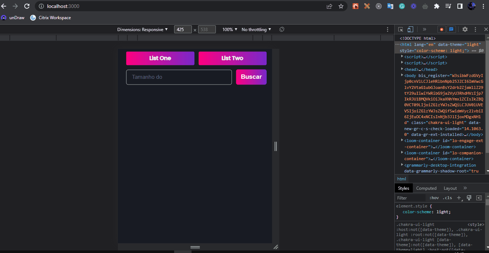

<h1 align="center">T10 | Challenge </h1>

<h1 align="center">
  
</h1>

## About 📃

This is a test for a frontend job on a [t10](https://www.t10.digital/).

--- 

## Techs 💻

- [React](https://reactjs.org/)
- [Vite](https://vitejs.dev/)
- [Chakra-Ui](https://chakra-ui.com/)

--- 

## How to install

```bash 
  #First make your enviroment of React Native cofigured.

  #Clone this project on your preference path
  $git clone https://github.com/Luan4560/first-challenge-rn-ignite.git

  #Then access your path, open the project and install the dependencies.

  $ yarn or npm install

  # Then you can run the app with

  $ yarn start
```

---

This project was made by Luan Nasicmento 🤘 and provides for BootCamp Ignite by [Rocketseat](https://rocketseat.com.br/) 🚀